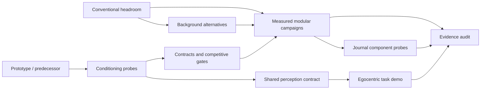

# Development stages

Dates locate work; input identity, implemented behavior and evaluation contract define stages. Several branches pursued different stages concurrently. A stage is a research question, not a claim of success. Start with the [code lineage report](domains/code.md); its commit cards retain the detailed changes and corrections.

| Stage | Development question | What survives for the paper | Boundary that prevents pooling |
|---|---|---|---|
| S0 — prototype and predecessor lineage | Can tracked objects, appearance and scene structure organize video delivery? | Architecture rationale and the move toward an independently reconstructing receiver; early implementations as development history. | Application demonstrations and predecessor descriptions are not PointStream rate–quality replications. |
| S1 — generative conditioning | Can pose plus a transmitted reference reconstruct a moving, identifiable player? | Explicit conditioning contracts, reference policies, compatibility failures and checkpoint-specific probes. | Self-image scoring, reference==target training, framewise temporal models and uncalibrated metrics invalidate several early rankings. |
| S2 — conventional headroom | Is removing foreground associated with enough coding reduction to motivate replacing it? | Changed-target conventional ladders over eight tennis scenes; a diagnostic upper-opportunity argument. | Removed foreground need not be reconstructed; this is not a same-source semantic-codec gain. |
| S3 — registered background | Can plates, maps, deltas or residuals reduce recurring background cost? | Tested cost decomposition, registration/correction failures and cold-start versus recurring-cost questions. | Cached/source-derived plates and single-plane assumptions must remain explicit; pixel error is not measured geometric drift. |
| S4 — competitive gates and modular contracts | Can a complete delivered candidate meet an anchor's cost and quality? | Full-wire ledger, delivered-frame scoring, access constraints, frozen-comparison requirements and gate repairs. | Constant tables, grey strips and accepted CLI options are not measurements; repaired gates do not validate old runs. |
| S5 — measured modular campaigns | Which foreground/background components consume the budget? | Real color/alpha/crop/motion controls and bounded negative operating points. | Components, 16-frame screens and 48-frame whole-codec candidates have different scopes and information access. |
| S6 — journal branch (JE) | Can compact silhouette and object color assembly clear a narrow operating point? | Component probes, byte arithmetic, discrepancy diagnosis and rejected amortization interpretation. | JE10 fresh-client reconstruction is unestablished; JE11 repeated costs are analytical projection. |
| S7 — perception unification | Can a common SAM 3.1/pose/rigid-object contract supply training and transport consistently? | Typed adapters/transforms, pilot failures, quarantines and explicit transport-parity prerequisites. | Coverage is not segmentation accuracy; inactive development manifests are not eligible training splits. |
| S8 — egocentric demo and neural background | Can hand/object tasks tolerate different foreground representations and scene fills? | Domain-specific task/representation questions, neural-codec costs and failed background fills. | Different clips, exposure, judges and camera motion prevent pooling with tennis or broad visual-codec claims. |
| S9 — evidence and preparation rebuild | What can be reproduced, retained or retracted? | Ten-chapter research package, retirement maps, recovery indexes and this dossier's verified source links. | A documentation correction or prospective experiment card is not a new experiment. |

The graph shows scientific dependencies, not a claim that every implementation descended directly from another. The [comparison map](COMPARABILITY.md) is deliberately finer than this stage map. The [paper map](PAPER_MAP.md) selects reusable evidence; the [coverage report](COVERAGE.md) distinguishes reviewed behavior from individually unreviewed intermediate patches.
