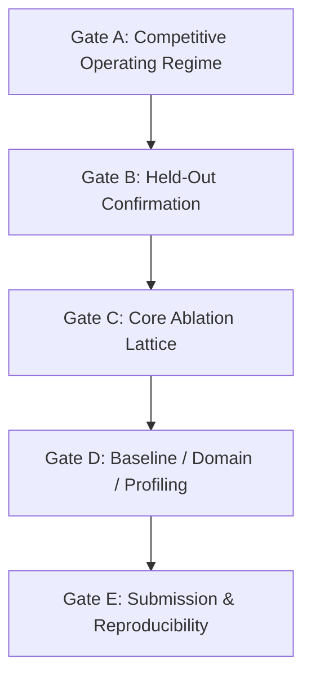

# PointStream Roadmap and Submission Gates

**Target Submission**: ACM TOMM — **30 September 2026** (hard deadline).
**Evidence Freeze**: 29 September 2026. Moved from 20 September by decision on
23 September. Development measurements through 29 September are authorized.
Held-out confirmation is skipped. A second domain runs only after a claimable
tennis point. The plan is
[the 23 September campaign](workflow/session/evaluation-campaign/20260923-development-campaign.md).

This document specifies the submission gates, dependencies, and pass criteria.
Through 30 September, execution follows the 23 September campaign linked above.
The [September campaign](workflow/session/evaluation-campaign/plan.md) remains
the historical gate design. Gate pass dependencies do not prevent parallel
readiness, component work, or writing setup. User decisions of 14 September
and 23 September supersede historical count rules and the 20 September freeze.

---

## 1. Submission Gates

### Gate A: Competitive Operating Regime (Open after audit)
- **Objective**: Establish at least one operating point (defined by scene domain, clip duration, bitrate, and quality metric) where PointStream strictly outperforms conventional codec baselines (AV1 / VVC).
- **Pass Criteria**:
  1. A reproducible advantage over the declared AV1 and VVC anchors over a measured overlapping rate/quality interval on a metric selected before the confirmation run. Declare anchor settings and uncertainty; no extrapolated BD-rate or isolated lucky-point victory.
  2. Operating regime fully characterized: content type, duration/amortization range, bitrate band, and component byte breakdown.
  3. Size, quality, and runtime measured and reported together; no speed omissions.
- **Current Status**: The 23 September decision metric is weighted PSNR
  (`0.7` foreground + `0.3` background). A claimable development point is
  weighted PSNR at least the anchor's, at no more bytes. The stored VVC
  comparison remains unfavorable overall, and no such point has been measured
  yet. See the [23 September campaign](workflow/session/evaluation-campaign/20260923-development-campaign.md).

Experiment policy: [hypothesis-driven probes](workflow/experiment-design.md). Full benchmark tables: [docs/areas/evaluation.md](areas/evaluation.md#gate-a-192-frame-benchmark-results-run-2--pr-83).

### Gate B: Held-Out Confirmation (Skipped for this submission)

The 23 September decision skips held-out confirmation for the 30 September
submission. A tennis result is a development operating point. The pass
criteria below stay the rule if confirmation is ever resumed.

### Gate B historical criteria (pass retracted)
- **Dependency**: Gate A passed.
- **Objective**: Confirm the selected codec procedure on held-out content, with the claim scoped to the split. See [data protocol](areas/data.md#4-confirmation-protocol). This is not a mandatory seven-training-video/six-test-video allocation.
- **Pass Criteria**:
  1. Prefer six independent matches reserved from development; a smaller count is
     explicitly authorized by the user on September 14. Before test scores, freeze
     the largest feasible untouched source set and count rationale in the manifest
     and matching verifier policy (E01). Planning target three, two only with
     explicit small-sample limitations; one is a case study. Report source-level
     uncertainty and declare inconclusive if it cannot establish the advantage.
     Within-source scene holdouts support narrower claims and do not become
     independent matches. Never drop a source after seeing its scores.
  2. Freeze the codec selection procedure, rate ladder, metrics, eligibility rules, and adaptation budget before inspecting confirmation scores. Per-video encoding/fitting is allowed under that procedure, including on evaluated frames; charge all transmitted weights/side information and fitting time. No manual retuning based on test outcomes.
  3. Standalone client decoding verified end-to-end.
  4. Both whole-frame metrics and object-scoped metrics reported with source-level standard errors or confidence intervals and null controls; frames are not independent replicates.
- **Current Status**: PR #85's old pass is invalid and its two sources are now
  exposed. Repairs #100–#102 do not certify those runs. E01 must freeze a fresh
  split and matching source-count policy; E06 must establish the tennis advantage;
  E07 must verify controls, standalone output/wire accounting, stable anchors and
  source uncertainty under that frozen procedure.

### Gate C: Core Ablation Lattice (Preparation only)
- **Dependency**: Gate B passed.
- **Objective**: Establish the empirical contribution of every pipeline component.
- **Pass Criteria**:
  1. Isolated evaluations for: background-only, appearance-only, motion-only, residual absent, and generation absent.
  2. Verification that disabled stages consume zero bytes and execute zero calls.
  3. Report measured rate–quality ordering across tiers (fast, balanced, quality), including dominated points or reversals. Investigate configuration failures; monotonic quality is not a guaranteed property of a perceptual codec.
  4. Required September 14 milestone: at least one neural foreground model clears
     the declared reference baselines at comparable total rate and client budget,
     with valid trajectory, fidelity and temporal controls plus uncertainty.
     Preserve failed/deferred training campaigns; no guaranteed model ordering.

### Gate D: Learned Baselines, Second Domain, and Receiver Profiling
- **Dependency**: Gate C for final gate passage. Neural anchors/profiling start
  earlier; secondary-domain experiments start after a measured tennis advantage.
- **Objective**: Contextualize results against learned neural codecs, test domain generality, and benchmark client reconstruction time.
- **Pass Criteria**:
  1. Benchmark against a recent published neural video codec in the identified
     regime. Claim SOTA only where comparisons with AV1, VVC and that neural
     anchor support it; name implementations, settings and hardware.
  2. Evaluate on a secondary domain (e.g., surveillance or conferencing) to establish domain bounds.
  3. Profile client reconstruction speed (FPS, memory footprint, decode latency) on target hardware.

### Gate E: Camera-Ready Submission Package
- **Dependency**: Gates A–D passed.
- **Objective**: Produce the final manuscript and reproducible artifact bundle.
- **Pass Criteria**:
  1. Manuscript within ACM TOMM budget (23 pages main text + 5 pages appendix).
  2. Complete run provenance: Git commit SHAs, config manifests, encoder builds/presets, and seed lists for all numbers.
  3. Reproducibility script capable of rebuilding tables and figures from immutable output JSONs.

---

Gate C preparation may proceed, but ablations do not substitute for the missing competitive result and held-out confirmation.

## 2. Operating Policies

1. **Search is the method, not a compromise**: We actively search the configuration space to discover where an object-centric semantic codec wins over conventional block-based codecs. All explored axes and bounds are reported honestly.
2. **Three-axis reporting**: Every published comparison must report size, quality
   and encoder/client time. Not every RD run requires new timing: statistically
   adequate representative profiles may be reused for compatible workload and
   hardware strata, with sample counts, uncertainty and evidence references.
   Missing timing excludes a speed claim, not otherwise valid RD evidence.
3. **Bound before believing**: Prior to reading results, establish two-sided plausible bounds. Values outside expected bounds trigger an alarm and require instrument verification before reporting.
4. **Independent verification**: Exploratory results may be reported as exploratory. A generalization claim requires the corresponding held-out protocol; do not relabel known development footage as unseen. Gate order governs pass decisions; ablation plumbing, source preparation, baseline setup, and profiling may advance before earlier gates pass.

5. **Anchor coverage**: Keep AV1 and VVC, with native-resolution reference curves and a separately labeled rate-control/resolution-adaptive comparison. A smallest sampled CQP endpoint is not a codec-wide bitrate floor. Score all rescaled decodes at the original display resolution and count rescaling time.

6. **Full-codec development**: Residual-free and generation-free sweeps are controls, not a required winning architecture. Restore standalone coded residual correction and search high-fidelity residual-on curves during Gate A. Permit bounded generator readiness/training before generator-free parity, with validated total rate–quality–runtime evaluation. Gate C formal ablations remain dependent on confirmation; component development does not.

7. **Live and playback search**: Screen low/native resolution and fps, valid
   colour paths and consequential interactions; refine the measured feasibility
   boundary with one or two intermediate points. Register latency/quality floors,
   count lookahead and startup, verify stable queues and report hardware-specific
   uncertainty. Future-frame panoramas or fitting remain offline when applicable.

8. **Decision before sweep**: Follow the [experiment design policy](workflow/experiment-design.md). Diagnose component headroom before broad rate ladders or training; predeclare a bounded probe and its promote/stop decision. Expected architecture orderings are hypotheses, never acceptance requirements.
