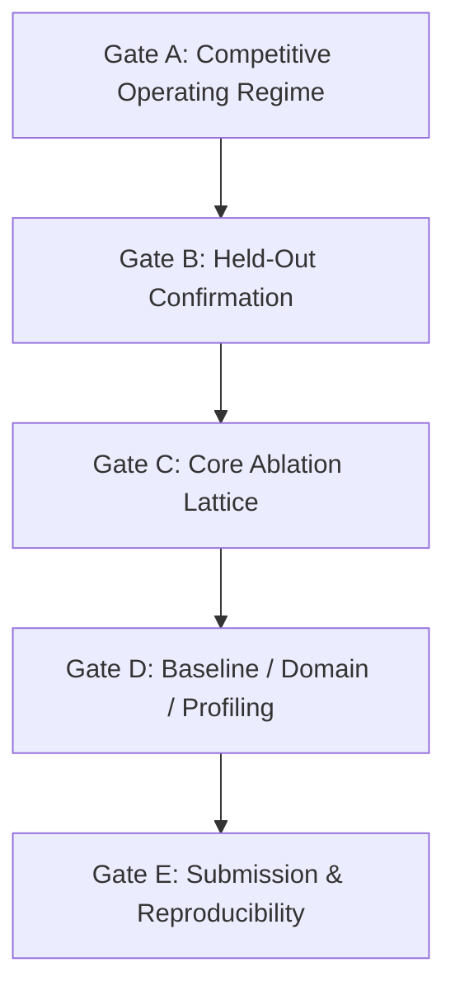

# PointStream Roadmap and Submission Gates

**Target Submission**: ACM TOMM — **30 September 2026** (hard deadline).
**Evidence Freeze**: 20 September 2026 (provisional target; revisable by explicit decision).

This document specifies the submission gates, dependencies, and pass criteria. Daily calendar rows are dropped in favour of dependency-driven gates.

---

## 1. Submission Gates

### Gate A: Competitive Operating Regime (Open after audit)
- **Objective**: Establish at least one operating point (defined by scene domain, clip duration, bitrate, and quality metric) where PointStream strictly outperforms conventional codec baselines (AV1 / VVC).
- **Pass Criteria**:
  1. A reproducible advantage over the declared AV1 and VVC anchors over a measured overlapping rate/quality interval on a metric selected before the confirmation run. Declare anchor settings and uncertainty; no extrapolated BD-rate or isolated lucky-point victory.
  2. Operating regime fully characterized: content type, duration/amortization range, bitrate band, and component byte breakdown.
  3. Size, quality, and runtime measured and reported together; no speed omissions.
- **Current Status**: PR #83/#84 pass interpretation superseded on 2026-09-09. The stored VVC comparison is unfavorable overall; the AV1 curves have no quality overlap and fail floor dominance. C2/C3 warrant a narrower development sweep, not a declared win. See the [evaluation audit](areas/evaluation.md).

Experiment policy: [hypothesis-driven probes](workflow/experiment-design.md). Full benchmark tables: [docs/areas/evaluation.md](areas/evaluation.md#gate-a-192-frame-benchmark-results-run-2--pr-83).

### Gate B: Held-Out Confirmation (Incomplete; pass retracted)
- **Dependency**: Gate A passed.
- **Objective**: Confirm the selected codec procedure on held-out content, with the claim scoped to the split. See [data protocol](areas/data.md#4-confirmation-protocol). This is not a mandatory seven-training-video/six-test-video allocation.
- **Pass Criteria**:
  1. Default: six independent matches reserved from development, following the existing manifest verifier. Six is a project target, not a statistical guarantee; report source-level uncertainty. A within-source scene holdout supports only a within-source claim and requires a prospective split/exposure audit; it does not satisfy the existing independent-match gate.
  2. Freeze the codec selection procedure, rate ladder, metrics, eligibility rules, and adaptation budget before inspecting confirmation scores. Per-video encoding/fitting is allowed under that procedure, including on evaluated frames; charge all transmitted weights/side information and fitting time. No manual retuning based on test outcomes.
  3. Standalone client decoding verified end-to-end.
  4. Both whole-frame metrics and object-scoped metrics reported with source-level standard errors or confidence intervals and null controls; frames are not independent replicates.
- **Current Status**: PR #85 completed only two 48-frame source pilots and its pass flag ignored competitive comparisons and protocol completion. Both VVC comparisons are unfavorable. Controls, independent-output scoring/wire accounting, source uncertainty, stable anchor policy and six-source eligibility remain unmet. Repair `EVAL-ACT-06`, search under `EVAL-ACT-07`, then freeze and confirm on reserved sources.

### Gate C: Core Ablation Lattice (Preparation only)
- **Dependency**: Gate B passed.
- **Objective**: Establish the empirical contribution of every pipeline component.
- **Pass Criteria**:
  1. Isolated evaluations for: background-only, appearance-only, motion-only, residual absent, and generation absent.
  2. Verification that disabled stages consume zero bytes and execute zero calls.
  3. Report measured rate–quality ordering across tiers (fast, balanced, quality), including dominated points or reversals. Investigate configuration failures; monotonic quality is not a guaranteed property of a perceptual codec.

### Gate D: Learned Baselines, Second Domain, and Receiver Profiling
- **Dependency**: Gate C passed.
- **Objective**: Contextualize results against learned neural codecs, test domain generality, and benchmark client reconstruction time.
- **Pass Criteria**:
  1. Benchmark against a published neural video codec baseline in the identified regime.
  2. Evaluate on a secondary domain (e.g., surveillance or conferencing) to establish domain bounds.
  3. Profile client reconstruction speed (FPS, memory footprint, decode latency) on target hardware.

### Gate E: Camera-Ready Submission Package
- **Dependency**: Gates A–D passed.
- **Objective**: Produce the final manuscript and reproducible artifact bundle.
- **Pass Criteria**:
  1. Manuscript within ACM TOMM budget (23 pages main text + 5 pages appendix).
  2. Complete run provenance: Git commit SHAs, config manifests, encoder builds/presets, and seed lists for all numbers.
  3. Reproducibility script capable of rebuilding tables and figures from immutable output JSONs.

---

Gate C preparation may proceed, but ablations do not substitute for the missing competitive result and held-out confirmation.

## 2. Operating Policies

1. **Search is the method, not a compromise**: We actively search the configuration space to discover where an object-centric semantic codec wins over conventional block-based codecs. All explored axes and bounds are reported honestly.
2. **Three-axis reporting**: Every published experiment must report size (bitrate/payload), quality (PSNR, SSIM, VMAF, LPIPS), and execution time (encode/decode).
3. **Bound before believing**: Prior to reading results, establish two-sided plausible bounds. Values outside expected bounds trigger an alarm and require instrument verification before reporting.
4. **Independent verification**: Exploratory results may be reported as exploratory. A generalization claim requires the corresponding held-out protocol; do not relabel known development footage as unseen. Gate order governs pass decisions; ablation plumbing, source preparation, baseline setup, and profiling may advance before earlier gates pass.

5. **Anchor coverage**: Keep AV1 and VVC, with native-resolution reference curves and a separately labeled rate-control/resolution-adaptive comparison. A smallest sampled CQP endpoint is not a codec-wide bitrate floor. Score all rescaled decodes at the original display resolution and count rescaling time.

6. **Full-codec development**: Residual-free and generation-free sweeps are controls, not a required winning architecture. Restore standalone coded residual correction and search high-fidelity residual-on curves during Gate A. Permit bounded generator readiness/training before generator-free parity, with validated total rate–quality–runtime evaluation. Gate C formal ablations remain dependent on confirmation; component development does not.

7. **Decision before sweep**: Follow the [experiment design policy](workflow/experiment-design.md). Diagnose component headroom before broad rate ladders or training; predeclare a bounded probe and its promote/stop decision. Expected architecture orderings are hypotheses, never acceptance requirements. Gate criteria above are unchanged.
