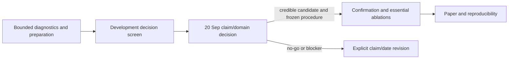

# PointStream roadmap and claim gates

Submission target: **30 September 2026**. The **20 September** checkpoint makes
an evidence, claim, and schedule decision; it may recommend a claim/date
revision if no credible replicated development candidate exists. It does not
force confirmation or make 30 September a guarantee.

Execution is in the [submission decision wave](workflow/session/evaluation-campaign/tasks/20260917-submission-decision-wave.md). Historical campaign text does not authorize work.

## Gate A — competitive operating regime

**Pass:** on predeclared development sources, a complete PointStream system has
matched achieved rate or an overlapping-quality advantage over uniform AV1 and
VVC that exceeds the predeclared meaningful effect and source uncertainty.
Identify content, duration/amortization, bitrate, metrics, component bytes,
encoder/client runtime, and all deployment assumptions. A single scene/point,
nonoverlapping curves, or rate-only saving does not pass.

**Current:** open. E06 reaches 17,581 B versus saved VVC 21,288 B, but inherits
20.68 dB versus 24.6 dB; it is not a win. A residual near 72–78 kB previously
bought about 3.4 dB and does not pay at this budget. The perfect-FG diagnostic
is limited to its masks/predictor/scorer and is not an architecture limit.

## Gate B — frozen confirmation

**Entry:** Gate A candidate, source audit, fixed source IDs/hash grid, metrics,
rate targets, adaptation/deployment policy, and standalone decode/ledger pass.
**Pass:** retain all eligible sources, report full-frame and calibrated regional
metrics with source-level uncertainty and null controls, and reproduce the
scoped development advantage. The current three 1080p reservations are not yet
released: exposure, replay and PTS audits are unfinished; source counts are not
frame counts. Confirmation cannot support an unmeasured native-4K claim.

Prefer six independent untouched sources. The authorized planning target is
three; two requires explicit small-sample limits and one is a case study. Never
drop a source after seeing scores. Freeze selection, rate ladder, metrics,
eligibility, and adaptation before scores. Per-video fitting is allowed when it
is part of that procedure, but charge its parameters, side information, and
fitting time. Frame observations are not independent: report source-level n and
uncertainty.

## Gate C — essential component evidence

After a candidate is selected, measure only essential ablations: background,
appearance/motion, residual, and generation where applicable. Disabled stages
must have zero calls and bytes. `T=B+F+M+R+H+declared deployment` and runtime
are required. Component probes diagnose mechanisms; they do not substitute for
the complete-system comparison.

## Gate D — learned anchor, second domain, receiver

The neural anchor must return an actual encode and standalone decode with exact
weights SHA, configuration, binary/version, decoded-frame hashes, bytes, and
timing; otherwise it is a visible submission blocker for a SOTA claim. The
bounded DCVC session is not a broad ladder. Evaluate the chosen procedure on a
second domain only after the development decision, and report client latency,
throughput, memory, and declared offline/lookahead conditions.

## Gate E — paper and reproducibility

Only accepted evidence may clear paper placeholders. The paper is at its
28-page verified budget, so panels replace material. Preserve immutable run
records, commands, inputs, binaries, configs, seeds, artifact hashes, ledgers,
and table/figure reconstruction.

## Operating policies

1. Write two-sided size, quality, and time bounds and their rationale before
   reading each result. An out-of-bound result is an instrument alarm.
2. Calibrate metrics with identical, mild, severe, and unrelated controls at
   the exact scored scope. Do not black-mask whole-frame LPIPS/VMAF.
3. Fairness requires a shared source, display grid, timebase, and accounting
   policy, with no uncharged masks, lookahead, aspect, or fps changes. Native
   formats may differ; charge each physical file and its format overhead.
   PointStream variants use a consistent container/accounting policy.
4. A semantic ROI encoder requires an observed ROI effect and null control;
   x265 AQ is not semantic ROI. Native ROI maps are encoder-only and client
   masks must be charged.
5. Valid RD evidence may remain valid when timing is missing, but cannot support
   a speed claim. Report cold startup, steady-state throughput, lookahead, and
   source-level timing uncertainty whenever receiver performance is claimed.
6. The original tennis-primary, neural-foreground-winner, and second-domain
   contract remains pending an explicit 20 September revision; an exploratory
   ego screen does not waive it.
