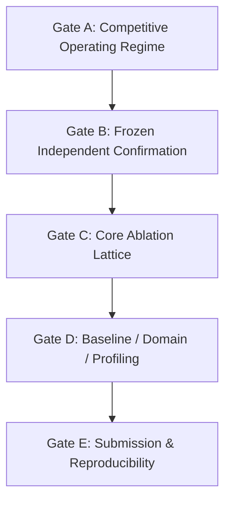

# PointStream Roadmap and Submission Gates

**Target Submission**: ACM TOMM — **30 September 2026** (hard deadline).
**Evidence Freeze**: 20 September 2026 (provisional target; revisable by explicit decision).

This document specifies the submission gates, dependencies, and pass criteria. Daily calendar rows are dropped in favour of dependency-driven gates.

---

## 1. Submission Gates

### Gate A: Competitive Operating Regime (Active)
- **Objective**: Establish at least one operating point (defined by scene domain, clip duration, bitrate, and quality metric) where PointStream strictly outperforms conventional codec baselines (AV1 / VVC).
- **Pass Criteria**:
  1. Rate–distortion curve strictly above the conventional anchor (or strictly lower rate at matched quality) on at least one declared metric suite.
  2. Operating regime fully characterized: content type, duration/amortization range, bitrate band, and component byte breakdown.
  3. Size, quality, and runtime measured and reported together; no speed omissions.
- **Current Status**: Open. Diagnostic 48-frame native run (#69) completed; identified background bitfloor in `libaom` and JPEG crop overhead as key bottlenecks. Proposed lean background (VVC intra / SVT-AV1) and WebP/AVIF appearance crops in #70–#72.

### Gate B: Frozen Independent Confirmation
- **Dependency**: Gate A passed.
- **Objective**: Verify that the winning regime holds on completely unseen content without post-hoc tuning.
- **Pass Criteria**:
  1. Six independent source sequences tested using the frozen winning configuration from Gate A.
  2. Zero hyperparameter tuning or configuration adjustment on the test set.
  3. Standalone client decoding verified end-to-end.
  4. Both whole-frame metrics and object-scoped metrics reported with standard error bounds and null controls.

### Gate C: Core Ablation Lattice
- **Dependency**: Gate B passed.
- **Objective**: Establish the empirical contribution of every pipeline component.
- **Pass Criteria**:
  1. Isolated evaluations for: background-only, appearance-only, motion-only, residual absent, and generation absent.
  2. Verification that disabled stages consume zero bytes and execute zero calls.
  3. Monotonic rate–quality progression verified across tiers (fast, balanced, quality).

### Gate D: Learned Baselines, Second Domain, and Receiver Profiling
- **Dependency**: Gate C passed.
- **Objective**: Contextualize results against learned neural codecs, test domain generality, and benchmark client reconstruction time.
- **Pass Criteria**:
  1. Benchmark against a published neural video codec baseline in the identified regime.
  2. Evaluate on a secondary domain (e.g., surveillance or conferencing) to establish domain bounds.
  3. Profile client reconstruction speed (FPS, memory footprint, decode latency) on target hardware.

### Gate E: Camera-Ready Submission Package
- **Dependency**: Gates A–D passed.
- **Objective**: Produce the final manuscript and reproducible artifact bundle.
- **Pass Criteria**:
  1. Manuscript within ACM TOMM budget (23 pages main text + 5 pages appendix).
  2. Complete run provenance: Git commit SHAs, config manifests, encoder builds/presets, and seed lists for all numbers.
  3. Reproducibility script capable of rebuilding tables and figures from immutable output JSONs.

---

## 2. Operating Policies

1. **Search is the method, not a compromise**: We actively search the configuration space to discover where an object-centric semantic codec wins over conventional block-based codecs. All explored axes and bounds are reported honestly.
2. **Three-axis reporting**: Every published experiment must report size (bitrate/payload), quality (PSNR, SSIM, VMAF, LPIPS), and execution time (encode/decode).
3. **Bound before believing**: Prior to reading results, establish two-sided plausible bounds. Values outside expected bounds trigger an alarm and require instrument verification before reporting.
4. **Independent verification**: A configuration that appears to win on the exploratory corpus cannot be cited as a paper result until confirmed under Gate B protocol.
