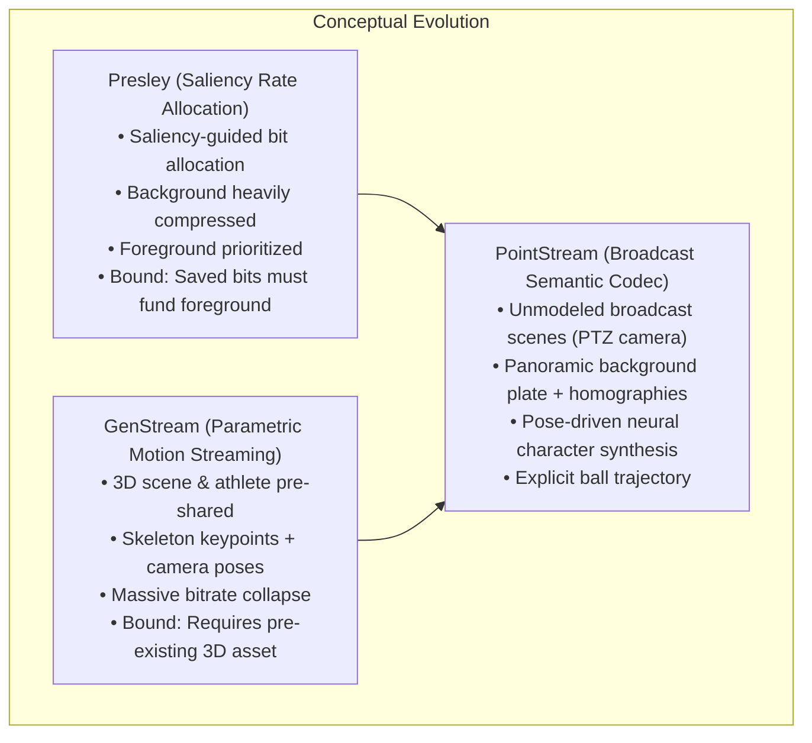
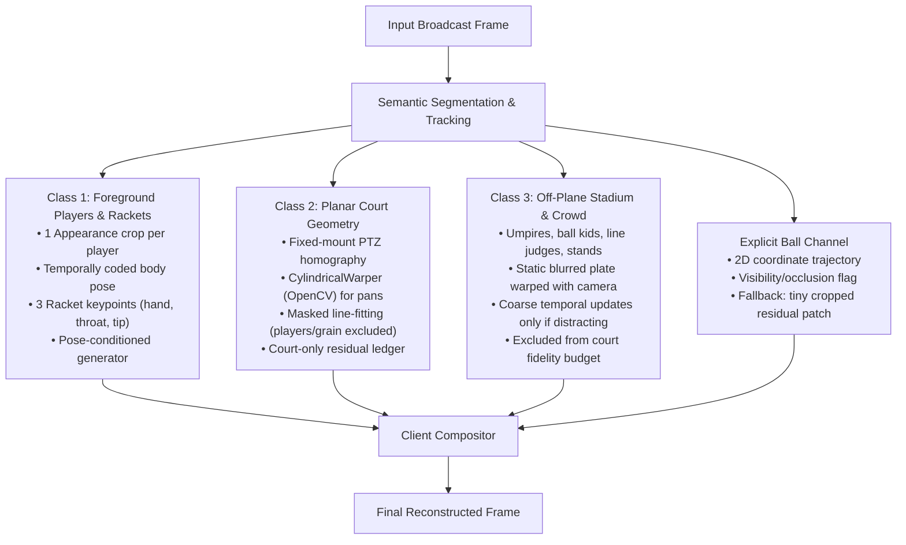
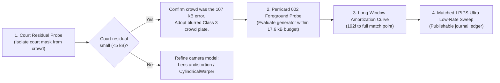

# PointStream: Semantic Codec Thesis, Empirical Reality, and Architectural Pivot

**Date:** 24 September 2026  
**Document Status:** Working Research Strategy & Architectural Blueprint  
**Primary References:**
- Presley Repository: `/home/itec/emanuele/presley/68e8b6bb11d0dd9e62a67aef`
- GenStream Repository: `/home/itec/emanuele/genstream/682c320f388146ae7ee133b7`
- PointStream Campaign Notes: `docs/workflow/session/evaluation-campaign/20260923-background-campaign.md`
- Codec Area Record: `docs/areas/codec.md`
- Evaluation Area Record: `docs/areas/evaluation.md`
- Generation Area Record: `docs/areas/generation.md`
- Paper Area Record: `docs/areas/paper.md`

---

## 1. Executive Summary & Conceptual Lineage

### 1.1 The Fundamental Premise
Traditional video compression algorithms (H.264/AVC, H.265/HEVC, H.266/VVC, AV1) operate primarily on pixel-level redundancy: discrete cosine/sine transforms (DCT/DST), block-based motion compensation, intra-prediction directions, and residual error quantization. These codecs are **semantically blind**—they do not know whether a macroblock belongs to a tennis court line, a spectator's jacket, an athlete's limb, or a tennis ball. Consequently, they expend immense bitrates attempting to reproduce high-frequency pixel variations and noise equally across all regions of a frame.

In contrast, human visual perception processes scenes through high-level mental models. A human observer understands common objects, their canonical physical structures, and their plausible motion dynamics. When viewing sports:
1. The **court geometry** is expected to be rigid, razor-sharp, and geometrically true (lines must not warp, jitter, or blur).
2. The **athletes** represent the primary focus of visual attention (saliency). Viewers track their body mechanics, racket swings, and identities.
3. The **ball** is small, high-velocity, and critical to the narrative of the game.
4. The **crowd, stands, and distant venue elements** are largely ignored as long as they do not exhibit distracting visual artifacts (flicker, blocking, or abrupt morphing).

The goal of semantic video coding is to bridge this gap: replacing blind pixel-level transmission with structured semantic parameters (geometry, poses, appearance priors, trajectories) and sending pixel residuals only where semantic priors fail.



### 1.2 The Conceptual Lineage: Presley to GenStream to PointStream
1. **Presley (`/home/itec/emanuele/presley/68e8b6bb11d0dd9e62a67aef`):**  
   Demonstrated that in videos with distinct salient regions, conventional codecs spend a disproportionate share of their bitrate budget on background textures that the viewer does not actively scrutinize. By heavily compressing the background relative to the foreground, Presley achieved substantial rate savings. However, Presley remained bounded by a fundamental conservation rule: *any bits saved by degrading or inpainting the background must be sufficient to restore the foreground at matching or superior perceptual fidelity.*
2. **GenStream (`/home/itec/emanuele/genstream/682c320f388146ae7ee133b7`):**  
   Addressed moving human subjects. Recognizing that articulating human bodies are expensive for block-based motion compensation to compress, GenStream used computer vision algorithms to track 2D/3D skeleton keypoints. In an Olympic figure-skating scenario where the athlete's appearance and the 3D stadium geometry are scanned or known in advance, streaming is reduced to skeleton keypoint vectors and camera poses. This yielded order-of-magnitude bitrate reductions over traditional video streaming.
3. **PointStream (Current Project):**  
   Set out to generalize GenStream to standard broadcast video where **no prior 3D model** of the venue or athlete exists. The insight was that in broadcast sports (as well as aerial and egocentric footage), the background is slow-changing and effectively planar from the perspective of a fixed-mount pan-tilt-zoom (PTZ) camera. Instead of re-encoding background blocks every GOP or segment when the camera pans away and returns, PointStream constructs a static panoramic plate using image stitching, transmits invertible homography matrices to warp the plate to any frame, and synthesizes the foreground players from transmitted skeleton keypoints conditioned on a single transmitted appearance reference.

### 1.3 Tennis as the Best-Case Experimental Domain
Tennis was selected as the canonical benchmark because it provides the most favorable conditions for semantic decomposition:
- **Two isolated athletes:** The players remain on opposite sides of the net and almost never visually occlude each other, drastically simplifying person detection, segmentation, and pose tracking.
- **Planar venue:** The tennis court is a flat 2D plane with high-contrast, standardized geometric lines.
- **Fixed-mount camera:** Broadcast cameras covering play are typically tripod-mounted high behind the baseline, executing purely rotational pan, tilt, and zoom (PTZ) with zero or negligible optical center translation.
- **Match-long temporal stability:** A tennis match lasts 2 to 5 hours on the identical court surface under relatively constant stadium or daylight conditions.
- **Explicit objects:** The only dynamic entities are the two players, their rackets, and a single high-contrast ball.

---

## 2. Generative Synthesis: Exploration, Benchmarks, and Failure Modes

To realize the PointStream decoder, a generative model is required that takes a reference appearance crop and a stream of skeleton keypoints, producing a temporally coherent video sequence of the athlete in motion.

### 2.1 Evaluated Generative Architectures
1. **`sd-controlnet-openpose` (Stable Diffusion + ControlNet OpenPose):**  
   - *Architecture:* 2D latent diffusion model conditioned on 2D OpenPose skeletons and text/CLIP embeddings.
   - *Empirical Outcome:* Generated single frames with reasonable pose alignment, but lacked a temporal dimension. Independent per-frame sampling produced intolerable high-frequency flickering, texture bubbling, and frame-to-frame identity shifts.
2. **SPADE & Multi-ControlNet Approaches:**  
   - *Architecture:* Spatially-adaptive denormalization (SPADE) and combined ControlNets conditioned simultaneously on OpenPose skeletons, semantic segmentation masks, and Canny edge detectors.
   - *Empirical Outcome:* Improved silhouette boundaries, but conditioning requirements (sending edge maps and dense masks) ballooned the transmission wire, destroying the bitrate advantage. Temporal stability remained unsolved.
3. **AnimateAnyone (HumanAIGC) & Tennis Fine-Tuning:**  
   - *Architecture:* ReferenceNet architecture injecting detailed appearance features via spatial cross-attention, combined with pose guidance and temporal attention layers trained on video sequences.
   - *Status:* Fine-tuned locally on broadcast tennis footage. Provides the strongest character identity retention and smooth inter-frame motion among evaluated diffusion backends.
   - *Critical Limitation:* The base model and standard COCO-17 pose extractors track only 17 human body joints. They have **no representation for the tennis racket** (hand, throat, tip). As a consequence, the generator smears, detaches, or hallucinates the racket during swings.
4. **MTTF (Extreme Human Video Compression with MTTF):**  
   - *Architecture:* Hybrid codec utilizing VVC to transmit anchor keyframes, combined with a neural motion-transfer model to synthesize intermediate frames.
   - *Reported Strengths:* Demonstrated substantial rate-distortion and perceptual gains over VVC on talking-head datasets (VoxCeleb) and simple moving-body sequences at ultra-low bitrates.
   - *Domain Mismatch with Broadcast Tennis:* Talking-head synthesis benefits from strong face priors where minor hallucinations (e.g., shirt wrinkles or hair strands) are perceptually harmless. In 4K broadcast tennis, hallucinating court lines, player kit logos, racket angles, or the ball is immediately catastrophic. Furthermore, MTTF has not been evaluated against the 4K texture requirements and rapid limb velocities typical of professional sports.

### 2.2 The Evaluation Dilemma: The Trap of Standard PSNR and VMAF
Standard objective metrics (Full-Frame PSNR, SSIM, VMAF) are fundamentally misaligned with the semantic coding objective:
- A deliberately softened, static crowd or blurred stands will severely depress full-frame PSNR (e.g., dropping from 31 dB to 23 dB), even if a human viewer cannot perceive any degradation in the peripheral background while watching the ball.
- Conversely, a full-frame PSNR metric will reward a conventional codec that preserves low-frequency stadium noise while blurring the tennis ball into invisibility or turning the player's face and racket into blocky macroblock soup at low bitrates.
- Scoring PointStream on monolithic full-frame PSNR creates a false dilemma: forcing the transmission of massive background residuals simply to match non-salient stadium textures, which wipes out the entire bitrate budget.

---

## 3. The Baseline Reality: VVC and AV1 Composite Long-Term Reference (LTR)

A foundational assumption in the early design of PointStream was that traditional codecs are inherently handicapped because they "forget" the background across segment boundaries or GOPs, forcing them to re-encode the scene whenever the camera pans away and returns.

### 3.1 The Breakthrough Discovery
Modern video coding standards (specifically VVC / H.266 and AV1) already possess mechanisms that achieve background caching:
- **VVC Composite Long-Term Reference (LTR):**  
  The encoder constructs a synthetic picture that is **never displayed** to the viewer. Using combined-cost optimization or motion segmentation, the encoder extracts static background blocks across multiple frames, inpainting or excluding moving foreground objects. This synthesized clean background plate is inserted into the Decoded Picture Buffer (DPB) as a long-term reference frame. Subsequent frames predict directly from this reference using standard block motion compensation and transmit only small prediction residuals.
- **AV1 Alternate Reference Frames (ARF / Overlay Frames):**  
  AV1 encodes filtered, non-displayed reference frames that pool temporal information across lookahead windows to act as high-efficiency prediction anchors.

### 3.2 Strategic Implications for PointStream
1. **Loss of Exclusivity Claim:** Background plate construction and long-term scene caching cannot be advertised as a novel theoretical advantage that conventional codecs are incapable of performing. VVC and AV1 can and do perform long-term background referencing.
2. **Fair Baseline Accounting:** Baselines must be allowed to utilize their long-term reference capabilities under matched memory and latency conditions. PointStream cannot claim an artificial victory against a baseline artificially hobbled with short closed-GOP constraints.
3. **Borrowing LTR Strengths into PointStream:**
   - *Block-Level Incremental Updates:* Rather than re-stitching and re-transmitting an entire panoramic plate when lighting shifts or a ball kid moves, PointStream should maintain a block-cached plate at the client, transmitting sparse block updates only when an error threshold is exceeded.
   - *Cost-Based Selection:* Leverage combined-cost selection or explicit segmentation masks to prevent foreground athlete pixels from corrupting the background reference plate.

---

## 4. Empirical Diagnosis: The Five Cursor Findings and Measured Realities

Rigorous empirical analysis conducted on real 48-frame 4K tennis windows (September 2026 campaign) has clarified what the architecture actually achieves versus theoretical assumptions.

### 4.1 Finding 1: The Thesis Lineage Is Coherent, But GenStream's Premise Fails Against VVC
The logical chain from Presley to GenStream to PointStream is scientifically sound:
- Presley established that background rate can be squeezed to prioritize foreground.
- GenStream proved that parametric pose replaces pixel transmission when scene and actor priors are pre-shared.

However, PointStream tested whether GenStream's result survives when:
1. The background is **not** a pre-shared 3D model, and
2. The athlete is **not** a pre-shared 3D renderer,
3. Evaluated on 4K broadcast sports against VVC at matched PSNR quality.

**The empirical answer is NO.** A single homography-warped 2D plate plus classical/generative foreground reconstruction does not beat VVC on a monolithic rate-distortion (PSNR) ledger on short windows. This is a definitive, publishable scientific finding, not an execution bug.

### 4.2 Finding 2: Two Bundled Bets, and Only One Is Real


#### Bet 1: Rate Allocation via Player Inpainting (REAL, BUT MODEST)
Removing the players with a clean inpainting plate and re-encoding the background video saves approximately **14% to 18% BD-rate** across eight 4K scenes (reaching up to 27% when the player occupies a large screen fraction, but dropping near 0% when the player is small and the camera pans rapidly).
- *The Crucial Budget Rule:* That 14–18% saving **is** the total bitrate budget available to reconstruct the player. If restoring the player costs more bits than this margin, the semantic codec loses to the anchor.

Measured evidence from the 23 September background campaign (QP 46, 48 frames, 3840×2160):
- **Large Player (Perricard scene 002, 2.99% mask):**  
  - Source VVC anchor: 104,482 B (Foreground: 24.93 dB, Background: 32.45 dB).  
  - Inpainted background video: 86,894 B (Background: 32.51 dB).  
  - **Budget remaining:** **17,588 B** (16.8% headroom).  
  - *Status:* The court is fully matched. The foreground only needs to match the anchor's 24.9 dB within 17.6 kB. This is the only measured clip offering a viable positive budget at matched court quality.
- **Medium Player / Static Camera (Alcaraz scene 000, 0.51% mask):**  
  - Source VVC anchor: 65,149 B (Foreground: 21.73 dB, Background: 33.84 dB).  
  - Panorama plate arm: 24,648 B (Background: 32.33 dB, 1.5 dB down from source).  
  - **Budget remaining:** **40,501 B**, but foreground must gain +0.65 dB over anchor to tie weighted PSNR.  
  - Inpainted video arm: 58,476 B (leaves only 6,673 B, failing the 8 kB feasibility gate).
- **Small Player / Panning Camera (Federer scene 007, 0.29% mask):**  
  - Source VVC anchor: 112,295 B (Foreground: 21.69 dB, Background: 31.36 dB, Weighted: 24.59 dB).  
  - Inpainted background video: 108,192 B (leaves only **4,103 B**, a 3.7% margin).  
  - Panorama plate arm: 35,763 B (Background: 23.15 dB; requires foreground to reach 25.2 dB, +3.5 dB over anchor).  
  - *Irony:* Federer scene 007, featuring a tiny player and a panning camera, represents the absolute worst-case scenario for this architecture, yet served as the primary development clip.

#### Bet 2: The Panorama Is NOT a Better Background Model than VVC (FALSE)
A single homography-warped panorama does not outperform VVC block motion compensation:
- On Federer scene 007, a registered panorama plate achieves only **23.15 dB** background PSNR.
- Transmitting a residual to lift the warped plate to 29.56 dB requires **107,005 B** at QP 46 (still short of VVC's 31.36 dB background).
- The plate plus residual equals **165,819 B**—substantially exceeding the **112,295 B full-frame VVC anchor** before a single byte of player data is transmitted!
- *Why VVC Wins on Background:* VVC's flexible quad-tree/binary-tree block motion compensation natively captures localized parallax, non-planar stands, audience motion, ball kids, and lens distortion. A global homography cannot map these non-planar structures.
- *Historical Echo:* MPEG-4 sprite coding encountered this exact mathematical boundary twenty years ago (Farin et al.). A single mosaic works only for pure rotation or planar scenes; once parallax or perspective error accumulates, multi-sprites or local residual coding become necessary.
- *The Amortization Fallacy:* Amortizing the static plate over a 3-hour match does **not** solve this problem. While the plate itself is sent once, the **107 kB warp residual must be paid every 48 frames**. A per-frame residual that matches the anchor's total bit budget can never be amortized.

### 4.3 Finding 3: Bitstream Wire Breakdown Reality
In the measured 48-frame appearance-motion control (totaling 136,228 bytes):
- **Raw COCO-17 keypoints:** 4,794 bytes (47 frames × 102 bytes of raw float16) = **3.5% of the wire**.
- **Appearance crop (AV1 intra):** 1,962 bytes = **1.4% of the wire**.
- **Background plate:** ~129,452 bytes = **95.1% of the wire**.

```
Bitstream Breakdown (136,228 B Total)
┌─────────────────────────────────────────────────────────────┬───────┬──────┐
│ Background Plate (129,452 B - 95.1%)                        │ Pose  │ Crop │
│                                                             │ (3.5%)│(1.4%)│
└─────────────────────────────────────────────────────────────┴───────┴──────┘
```

Even if pose data were compressed using temporal delta prediction and lossy quantization to under 1 kB, or eliminated entirely (0 bytes), the bitstream would still exceed the VVC anchor (112 kB). Pose compression is good engineering hygiene, but it cannot alter the outcome of the rate-distortion comparison. The background representation dictates the bitrate.

---

## 5. Architectural Pivot: Three-Layer Decomposition + Explicit Ball

The core defect of earlier iterations was treating everything behind the players as a single monolithic 2D background. The 107 kB residual was not caused by failure to fit the court; it was caused by stands, spectators, chair umpires, and ball kids violating the planar homography assumption.

The architecture is therefore restructured into a three-layer representation with an explicit ball channel:



### 5.1 Class 1: The Players and Rackets (Dynamic Articulating Humans)
- **Transport:** One high-quality appearance crop per player transmitted at match start (or refreshed upon major scale/lighting change), followed by temporally predicted, quantized 2D joint coordinates.
- **Racket Modeling (Critical Gap Closure):** Standard pose extractors (COCO-17) track only human anatomy. The racket must be explicitly represented with 2 to 3 dedicated keypoints:
  1. Hand / grip joint
  2. Racket throat
  3. Racket tip / head apex
  Without these conditioning points, neural generators inevitably smear or drop the racket.
- **Wire Cost:** ~1 kB per 48 frames for pose deltas; appearance amortized to negligible fractions over long windows.

### 5.2 Class 2: The Planar Court Geometry (Rigid Planar Surface)
- **Exact Geometry:** On a planar tennis court viewed by a camera with zero optical translation, a homography is the mathematically exact frame-to-frame mapping, accounting for arbitrary pan, tilt, and focal zoom.
- **Cylindrical Warping for Horizontal Pans:** Flat planar projection (`PlaneWarper`) suffers severe tangential stretching and pixel dilation at wide angles. Using OpenCV's `CylindricalWarper` maps horizontal panning smoothly onto a cylinder, preventing edge distortion (the foundational insight of Farin's multi-sprite partitioning).
- **Robust Alignment Pipeline:**
  1. Mask out all humans and moving entities prior to feature matching.
  2. Apply a gentle blur to suppress grass/clay high-frequency texture noise, locking feature alignment strictly onto high-contrast court lines and boundary marks.
  3. Undistort radial lens distortion prior to fitting if broadcast camera intrinsics are available.
- **Synthesis Constraint:** The court plate is built strictly from original camera pixels with seam blending. Generative hallucination of court lines is strictly prohibited.
- **Court-Only Residual:** The court residual **must be scored exclusively on the court surface mask**. If the residual on the court mask is minimal, the previously observed 107 kB residual is confirmed to have originated entirely from off-plane crowd elements.
- **The Ball:** The tennis ball belongs to this layer. Transmit an explicit 2D sub-pixel trajectory and radius. If tracking is lost due to motion blur or occlusion, fall back to a small bounding-box residual patch.

### 5.3 Class 3: Off-Plane Stadium, Umpires, and Crowd (Non-Planar Background)
- **Semantic Role:** Umpires, line judges, ball kids, grandstands, and spectators sit at varying physical depths off the court plane, violating the homography.
- **Perceptual Strategy:** These regions carry minimal viewer task saliency. They are represented by a single, static, pre-softened plate warped using the same camera update as the court.
- **Update Policy:** Rather than attempting to maintain 31 dB PSNR on audience clothing, accept soft background textures. Transmit low-rate, heavily quantized temporal updates only when conspicuous motion (e.g., an umpire climbing down or a ball kid running) creates jarring visual discrepancies.

---

## 6. Defensible Scientific Claims and Publication Roadmap

### 6.1 What Cannot Be Claimed
- **No PSNR Victory on 48-Frame 4K Windows:** PointStream cannot claim an objective rate-distortion win (PSNR or VMAF) over VVC or AV1 on short, high-resolution broadcast windows where background textures are scored uniformly against ground truth.

### 6.2 The Defensible Journal Claim
For fixed-mount pan-tilt-zoom sports broadcasts, an object-centric semantic codec that decomposes the scene into:
1. **Cached, geometrically exact planar surfaces (the court),**
2. **Parametrically animated human actors (pose-driven generation), and**
3. **Explicitly signaled physical objects (the ball trajectory),**

delivers **superior perceptual quality (LPIPS, user preference) in the ultra-low-rate regime** where conventional codecs suffer catastrophic macroblocking, motion smearing, and line jitter, while PointStream preserves razor-sharp court geometry and recognizable human identity.

```
Visual Quality Regime Comparison:
Quality
  ▲
  │                          /── PointStream (Court sharp, player recognizable)
  │                         /
  │   VVC / AV1            /
  │   (Pixel-level)       /
  │        \             /
  │         \           /
  │          \         /
  │           \       /
  │            \     / 
  │             \   /
  │              \ / ◄── Crossover Point (Catastrophic macroblocking in VVC)
  │               X
  │              / \
  │             /   \── VVC smeared / unwatchable
  └────────────┴─────┴────────────────────────► Bitrate
               Ultra-Low    Standard Broadcast
                 Rate             Rate
```

### 6.3 Distinction from Talking-Head Codecs
Talking-head systems (e.g., Face-Vid2Vid, Wang et al., MTTF) generate the entire frame from a face prior. In that domain, hallucinating a sweater fold, background bookshelf, or earring is acceptable. In sports broadcast, **hallucinating a court line or ball trajectory destroys the integrity of the sport**. PointStream's core contribution is the principled split: exact geometry is preserved deterministically, deformable appearance is synthesized parametrically, and unmodeled dynamic objects are transmitted explicitly.

### 6.4 Experimental Verification Protocol
To substantiate this revised claim, the empirical evaluation must execute the following sequence:

| Step | Objective | Primary Metric | Target / Gate |
|---|---|---|---|
| **1. Court Lock Diagnostic** | Verify homography + cylindrical warping on court alone. | Court-Mask PSNR & Line Displacement (px) | Residual < 5 kB/sec on court mask alone. |
| **2. Break-Even Amortization Curve** | Plot cumulative bits vs. duration (48f, 192f, 1000f+). | Cumulative Bits vs. Time (seconds) | Identify exact sequence length where curve crosses VVC anchor. |
| **3. Foreground Return Budget** | Reconstruct player within the saved inpainting budget. | Player-Region LPIPS & Pose OKS | Match or exceed anchor player quality within 17.6 kB on Perricard 002. |
| **4. Ultra-Low-Rate Benchmark** | Compare PointStream against VVC/AV1 pushed into extreme compression. | Player LPIPS, Court Line Straightness, User Study | Clear perceptual preference over smeared baseline macroblocks. |
| **5. Racket Keypoint Conditioning** | Integrate 3 racket points (hand, throat, tip) into pose stream. | Racket IoU / Visual Smear Check | Elimination of racket warping/smearing artifacts during fast swings. |

---

## 7. Action Plan, Governance, and Open Decisions



### 7.1 Immediate Execution Tasks
1. **Implement Court-Mask Residual Isolation:**  
   Execute `warp_residual_probe.py` evaluated strictly inside the binary court boundary mask (`masks_court.npz`), excluding stands, crowd, and sky. Measure whether the warp residual drops from 107 kB to < 10 kB.
2. **Evaluate CylindricalWarper:**  
   Replace `PlaneWarper` with `cv2.detail.CylindricalWarper` on panning clips (Federer scene 007) and measure boundary alignment error.
3. **Execute Foreground Test on Perricard 002:**  
   Focus generative character reconstruction on Perricard scene 002 where a genuine 17,588 byte budget exists at matched court quality.
4. **Benchmark Baselines with Long-Term Reference (LTR):**  
   Configure VVC and SVT-AV1 with long-term reference pictures enabled to establish a rigorous, honest baseline.

### 7.2 Core Governance Decisions for the Research Team

```
┌────────────────────────────────────────────────────────────────────────────────────────┐
│ DECISION 1: Venue & Submission Deadline (ACM TOMM, 30 September 2026)                  │
├────────────────────────────────────────────────────────────────────────────────────────┤
│ The 65.4% / 32.5% rate ladder claims were from a constant table and are withdrawn.     │
│ A monolithic PSNR victory on 48-frame 4K windows is impossible.                        │
│ Options:                                                                               │
│ A) Pivot the Sept 30 paper to the honest negative-result / regime-boundary framing:    │
│    Documenting why monolithic background homographies fail against VVC, establishing  │
│    the 3-class decomposition, and demonstrating ultra-low-rate perceptual advantages.  │
│ B) Defer submission to an upcoming venue (e.g., IEEE TMM / CVPR) to allow full         │
│    implementation of racket keypoints, cylindrical warpers, and match-long curves.     │
└────────────────────────────────────────────────────────────────────────────────────────┘

┌────────────────────────────────────────────────────────────────────────────────────────┐
│ DECISION 2: Formal Metric Pivot in PLAN.md                                             │
├────────────────────────────────────────────────────────────────────────────────────────┤
│ Currently, PLAN.md enforces: "Weighted PSNR (0.7 FG + 0.3 BG) >= anchor at <= bytes". │
│ As established, full-frame PSNR inherently penalizes the softened background.          │
│ Recommendation: Formally amend the evaluation protocol to:                             │
│ 1. Court Geometry Preservation: Court-mask PSNR >= anchor court PSNR.                  │
│ 2. Player Quality: Player-region LPIPS <= anchor player LPIPS at matched low rate.     │
│ 3. Full-Wire Bitrate: Total bits <= anchor bits over amortized match windows.          │
└────────────────────────────────────────────────────────────────────────────────────────┘

┌────────────────────────────────────────────────────────────────────────────────────────┐
│ DECISION 3: Foreground Model Conditioning Path                                         │
├────────────────────────────────────────────────────────────────────────────────────────┤
│ AnimateAnyone fine-tuning currently smears rackets because of COCO-17 limitations.     │
│ Options:                                                                               │
│ A) Retrain/fine-tune the pose adapter with 20 keypoints (COCO-17 + hand/throat/tip).   │
│ B) Transmit an explicit small cropped pixel residual patch around the racket.         │
│ C) Test MTTF on tennis crops to evaluate whether its inter-frame engine handles racket │
│    motion without explicit keypoint conditioning.                                      │
└────────────────────────────────────────────────────────────────────────────────────────┘
```
