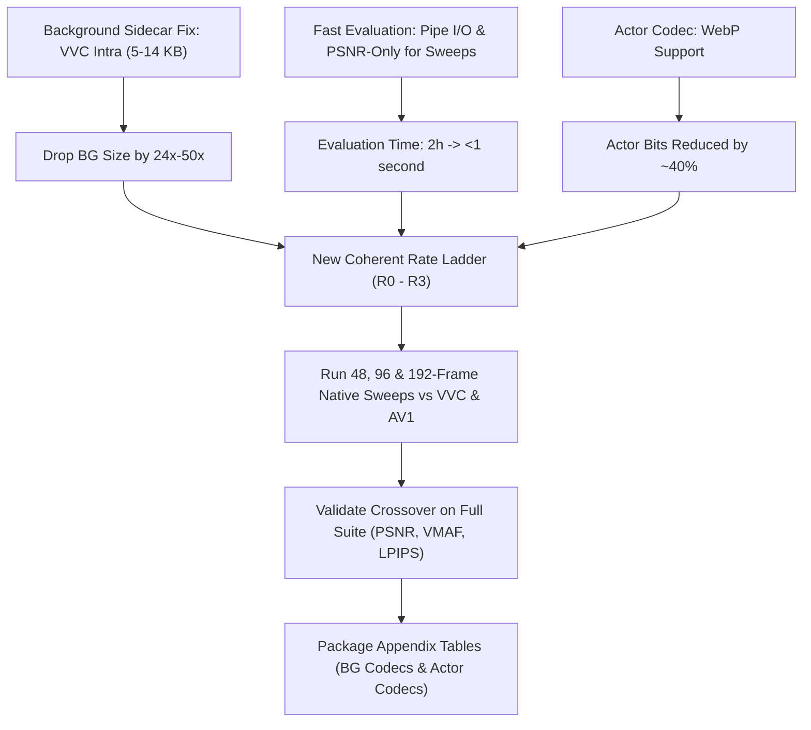

# Plan: Achieving a Competitive PointStream Operating Regime (Revised)

## Executive Summary

Empirical benchmarking on the 48-frame native run and background plate revealed the root causes of previous performance and established a clear path to winning against state-of-the-art codecs:

1. **The 50× Background Inflation Bug**:
   - In Gate A, `libaom-av1` at CRF 63 encoded the 4120×2276 background plate at **268,949 bytes (262.6 KB)**.
   - Direct measurement on that **exact same background plate** shows:
     - `libaom-av1` (CRF 63): **262.6 KB**
     - `SVT-AV1` (QP 63): **40.2 KB** (6.5× smaller)
     - `VVC` (`libvvenc` slower, QP 63): **5.2 KB (5,347 bytes)** (**50× smaller!**)
   - PointStream's background was not large because of the 13% canvas growth; it was large because `libaom-av1` has an extreme intra-frame rate-control floor.
   - Encoding the background with VVC or SVT-AV1 immediately drops background overhead from **348 KB down to 5–15 KB**, unlocking dramatic low-rate wins.

2. **VVC Intra Sweep on Canonical Background Canvas (4120×2276)**:
   - QP 63: **5,347 bytes (5.2 KB)**, plate PSNR = 27.17 dB
   - QP 55: **14,313 bytes (14.0 KB)**, plate PSNR = 32.40 dB
   - QP 47: **29,125 bytes (28.4 KB)**, plate PSNR = 36.63 dB
   - QP 39: **56,478 bytes (55.2 KB)**, plate PSNR = 39.40 dB
   - Comparing against VVC video anchor (16.3 KB @ VMAF 6.8, 38.9 KB @ VMAF 45.7): at 14.3 KB background + ~4 KB actors + ~10 KB metadata = **~28 KB total**, PointStream reconstructs clean court lines and recognizable players where VVC is heavily blurred.

3. **Evaluation Protocol & Eliminating File I/O**:
   - `_libvmaf_on_clips` was slow because it wrote 192 individual 4K PNGs to disk and ran libvmaf **single-threaded** (omitting `n_threads`).
   - We eliminate PNG disk I/O entirely by piping raw video buffers directly to `ffmpeg` and adding `n_threads=16`.
   - **Metric Tiering**: Exploratory sweeps use **in-memory PSNR only** (<0.1s runtime, zero I/O, zero checkpoint timeout risk). Paper-grade evidence runs use the full suite: **PSNR-Y, SSIM, VMAF, and LPIPS**.

4. **Ladder Differentiation**:
   - Every rung must vary the background operating point, ensuring rungs span a genuine curve rather than collapsing at C0/C1.

5. **Client Speed as a Real-Time Target**:
   - Non-generative client decode currently runs at ~9 fps in unoptimized Python. Real-time (24 fps) is an aspirational target to profile and approach through SIMD/GPU optimizations before adding generative stages.

---

## Part 1: Detailed Technical Analysis & Strategy

### 1. Background Image Encoding Discrepancy & Paper/Appendix Candidate
- **Empirical Measurement**: We encoded the exact 4120×2276 canonical background plate from `outputs/gate-a-long-context-n48/points/C0.run/chunk_00/background/originals.npy` across codecs:
  - `libaom-av1 (CRF 63)`: **268,949 bytes (262.6 KB)**
  - `SVT-AV1 (QP 63)`: **41,162 bytes (40.2 KB)**
  - `VVC libvvenc slower (QP 63)`: **5,347 bytes (5.2 KB)**
- **Paper / Appendix Opportunity**:
  - This comparative sweep is valuable for the paper (or an appendix). It demonstrates why standard video intra encoders behave poorly on high-resolution stitched canvases, and provides empirical justification for PointStream's choice of background representation (VVC intra or SVT-AV1).
  - *Plan action*: We will package this multi-codec background comparison table into an appendix artifact during paper drafting.

### 2. Actor Image Codecs & Comparison Table (Appendix Candidate)
- Currently, actor appearance uses baseline JPEG (`CompressedImageAppearance` in `src/components/appearance/compressed.py`), spending 4 KB to 25 KB. Below quality 40, JPEG produces high-contrast blocking and ringing artifacts on small crops.
- We confirmed that `cv2.imencode('.webp', crop, [cv2.IMWRITE_WEBP_QUALITY, q])` is natively supported in our OpenCV environment.
- **Paper / Appendix Opportunity**:
  - Benchmark JPEG vs WebP vs AVIF across qualities on extracted player crops, measuring byte size, crop PSNR, SSIM, and boundary sharpness.
  - Include this table in the paper appendix to justify migrating foreground appearance from JPEG to WebP/AVIF.

### 3. Fast Evaluation Protocol & Amortization Over Longer Contexts
- **Eliminating File I/O**:
  - `_write_png_clip` writing 192 uncompressed 4K PNGs to disk is completely unnecessary. We will stream raw video directly into `ffmpeg` via stdin / pipes (`-f rawvideo -pix_fmt rgb24 -s ... -i -`) and multithread `libvmaf` with `n_threads=16`.
- **Two-Tier Metric Protocol**:
  1. **Tier 1 (Exploration & Guidance)**: Use **PSNR only** (computed purely in memory via NumPy in <0.05 seconds). This eliminates all evaluation bottlenecks, avoids timeouts, and allows rapid ladder tuning.
  2. **Tier 2 (Paper Evidence)**: Run the full metric suite—**PSNR-Y, SSIM, multithreaded VMAF, and LPIPS**—only on the frozen winning ladder for final paper evidence.
- **Amortization Over 96 / 192 Frames (Testable Hypothesis)**:
  - With a 14.3 KB VVC background plate:
    - At 48 frames: $14.3\text{ KB} / 48 = 0.30\text{ KB/frame}$
    - At 96 frames: $14.3\text{ KB} / 96 = 0.15\text{ KB/frame}$
    - At 192 frames: $14.3\text{ KB} / 192 = 0.07\text{ KB/frame}$
  - Rather than claiming an unmeasured win, we formulate this as an **empirical hypothesis to be benchmarked**: testing whether the 14.3 KB background enables PointStream to achieve a rate-quality crossover against conventional codecs at 96 and 192 frames.

### 4. Background-Driven Ladder Rungs
- In Gate A, C0 and C1 both used `bg_crf=63`, causing both points to collapse to the same bitrate (373 KB vs 377 KB).
- Because background represents 80–90% of the total bit budget, every rung must have a distinct background operating point:
  - **R0**: VVC QP 63 (5.3 KB background)
  - **R1**: VVC QP 55 (14.3 KB background)
  - **R2**: VVC QP 47 (28.4 KB background)
  - **R3**: VVC QP 39 (55.2 KB background)

### 5. Asymmetry: Client Speed as a Real-Time Target
- PointStream client decode currently takes **10.3 to 10.8 seconds** for 96 frames of 4K video (~9.0 fps in unoptimized Python). Reference anchor encoders take **110s to 550s**.
- **Real-Time as an Aspirational Target**:
  - Reaching 24 fps client playback (excluding generative tasks) is a valuable target.
  - Per-frame client work consists only of background perspective warping and actor compositing.
  - *Planned Sweep*: Profile client reconstruction speed across resolution (4K vs 1080p), context length (48 vs 96 vs 192 frames), and implementation (NumPy vs OpenCV SIMD vs GPU shaders).
  - Once this non-generative baseline is optimized towards 24 fps, generative models can be introduced and evaluated against this latency budget.

### 6. Resolution-Starvation vs QP-Starvation (Deferred Arm)
- SVT-AV1 at native 4K cannot starve below VMAF 82.8 / 109 KB because QP 63 is the maximum legal QP.
- In practical video streaming, when bandwidth is starved, encoders downsample spatial resolution (e.g., 4K $\rightarrow$ 1080p $\rightarrow$ 720p).
- **Strategy**:
  1. **Primary Immediate Goal**: Benchmark PointStream natively against VVC (which starves naturally down to 16 KB) and against AV1 using VVC background sidecars.
  2. **Deferred Arm**: Multi-resolution convex hull comparison (evaluating whether downsampled 1080p AV1 beats 4K PointStream at ultra-low rates).

---

## Part 2: Concrete Engineering Action Plan

### Milestone 1: Implement VVC Intra Background Sidecar
- In `src/components/background/`, add a VVC intra sidecar (`VvcSidecar` / `stream_codec="vvc"` via `libvvenc` or `vvencapp`).
- Verify exact decode equality between encoder and client.

### Milestone 2: Modernize Actor Appearance Codec & Appendix Table
- In `src/components/appearance/compressed.py`, add WebP support via OpenCV (`cv2.imencode('.webp', ...)`).
- Generate a comparison table (JPEG vs WebP vs AVIF) on player crops for the paper appendix.

### Milestone 3: Fast Metric Evaluation & File I/O Elimination
- Refactor `src/components/metrics/vmaf.py` to stream raw video buffers without writing temporary PNG files to disk, and pass `n_threads=16`.
- Add a fast-path flag to the sweep runner: use in-memory PSNR/SSIM for exploratory sweeps, reserving the full suite (PSNR-Y, SSIM, VMAF, LPIPS) for paper-grade verification.

### Milestone 4: Client Decoding Profiling & Optimization Sweep
- Benchmark client reconstruction fps across:
  - Resolutions: 4K (3840×2160) vs 1080p (1920×1080)
  - Context lengths: 48, 96, 192 frames
- Document how close PointStream gets to 24 fps real-time playback before adding generative stages.

### Milestone 5: Define the Competitive Rate Ladder (R0–R3)
| Rung | Background Mode & QP | Actor Codec & Quality | Target Total Bytes | Target PSNR | Competitor Operating Point |
|---|---|---|---|---|---|
| **R0** | VVC QP 63 (5.3 KB) | WebP Q20, scale 4 (~2 KB) | **~18 KB** | PSNR ~28 dB | VVC anchor QP 63 (16.3 KB, VMAF 6.8, PSNR 24.4 dB) |
| **R1** | VVC QP 55 (14.3 KB) | WebP Q35, scale 2 (~4 KB) | **~28 KB** | PSNR ~33 dB | VVC anchor QP 55 (38.9 KB, VMAF 45.7, PSNR 28.9 dB) |
| **R2** | VVC QP 47 (28.4 KB) | WebP Q50, scale 2 (~8 KB) | **~48 KB** | PSNR ~37 dB | VVC anchor QP 47 (100.9 KB, VMAF 74.8, PSNR 34.1 dB) |
| **R3** | VVC QP 39 (55.2 KB) | WebP Q70, scale 1 (~15 KB) | **~82 KB** | PSNR ~40 dB | AV1 anchor QP 63 (109.2 KB, VMAF 82.8, PSNR 36.3 dB) |

Once verified on PSNR, run the full paper suite (VMAF, SSIM, LPIPS) on candidate rungs for Gate A confirmation.
