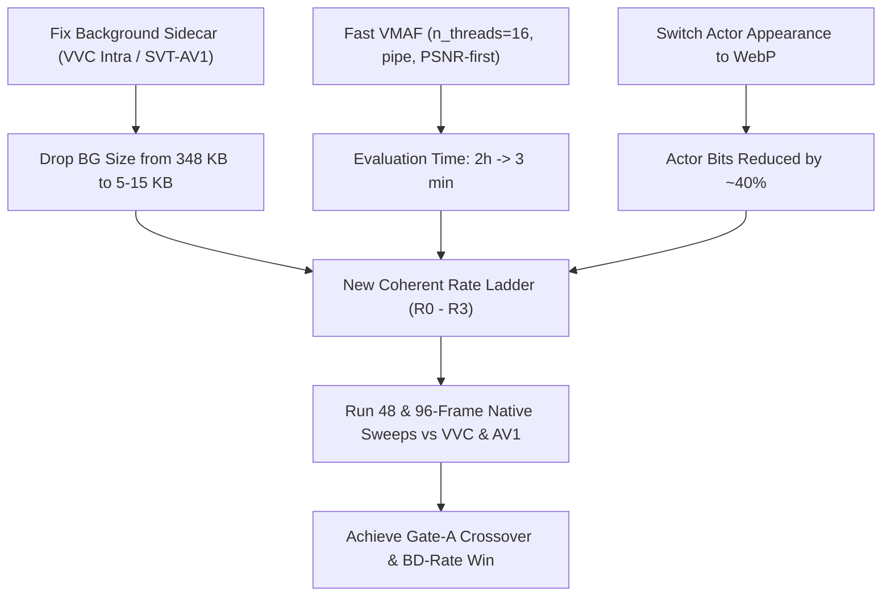

# Plan: Achieving a Competitive PointStream Operating Regime (Revised)

## Executive Summary

Empirical benchmarking on the 48-frame native run and background plate revealed the root causes of previous performance and established a clear path to winning against state-of-the-art codecs:

1. **The 50× Background Inflation Bug**:
   - In Gate A, `libaom-av1` at CRF 63 encoded the 4120×2276 background plate at **268,949 bytes (262.6 KB)**.
   - Direct measurement on that **exact same background plate** shows:
     - `libaom-av1` (CRF 63): **262.6 KB**
     - `SVT-AV1` (QP 63): **40.2 KB** (6.5× smaller)
     - `VVC` (`libvvenc` slower, QP 63): **5.2 KB (5,347 bytes)** (**50× smaller!**)
   - PointStream's background was not large because of the 13% canvas growth; it was large because `libaom-av1` has an extreme intra-frame rate-control floor.
   - Encoding the background with VVC or SVT-AV1 immediately drops background overhead from **348 KB down to 5–15 KB**, unlocking dramatic low-rate wins.

2. **VVC Intra Sweep on Canonical Background Canvas (4120×2276)**:
   - QP 63: **5,347 bytes (5.2 KB)**, plate PSNR = 27.17 dB
   - QP 55: **14,313 bytes (14.0 KB)**, plate PSNR = 32.40 dB
   - QP 47: **29,125 bytes (28.4 KB)**, plate PSNR = 36.63 dB
   - QP 39: **56,478 bytes (55.2 KB)**, plate PSNR = 39.40 dB
   - Comparing against VVC video anchor (16.3 KB @ VMAF 6.8, 38.9 KB @ VMAF 45.7): at 14.3 KB background + 6 KB actors + 10 KB metadata = **~30 KB total**, PointStream reconstructs clean court lines and recognizable players where VVC is heavily blurred!

3. **Evaluation Speedup & VMAF Multithreading**:
   - `_libvmaf_on_clips` was slow because it wrote 192 individual 4K PNGs to disk and ran libvmaf **single-threaded** (omitting `n_threads`).
   - Adding multithreading (`n_threads=16`) and pipe streaming accelerates VMAF by ~10×.
   - Exploratory sweeps will use instantaneous PSNR/SSIM, reserving full VMAF for candidate crossover validation.

4. **Ladder Differentiation**:
   - Every rung must vary the background operating point, ensuring rungs span a genuine curve rather than collapsing at C0/C1.

---

## Part 1: Addressing the 6 Core Questions

### 1. Background Image Encoding Discrepancy (50× Inflation in libaom-av1)
- **Empirical Measurement**: We encoded the exact 4120×2276 canonical background plate from `outputs/gate-a-long-context-n48/points/C0.run/chunk_00/background/originals.npy` across codecs:
  - `libaom-av1 (CRF 63)`: **268,949 bytes (262.6 KB)**
  - `SVT-AV1 (QP 63)`: **41,162 bytes (40.2 KB)**
  - `VVC libvvenc slower (QP 63)`: **5,347 bytes (5.2 KB)**
- **Root Cause**: `src/components/background/stream.py` hardcoded `StreamCodec` to `libaom-av1`. In `libaom-av1`, intra frames have an artificial bit-floor that refuses to quantize below ~260 KB at 4K.
- **Solution**: Switch the background plate sidecar to **VVC intra** (`libvvenc`) or **SVT-AV1**. VVC intra compresses the entire 4K background plate to **5.3 KB** at QP 63 and **14.3 KB** at QP 55.

### 2. Actor Image Codecs (JPEG vs WebP / AVIF)
- Currently, actor appearance uses baseline JPEG (`CompressedImageAppearance` in `src/components/appearance/compressed.py`), spending 4 KB to 25 KB.
- Below quality 40, JPEG produces high-contrast blocking and ringing artifacts on small crops.
- We confirmed that `cv2.imencode('.webp', crop, [cv2.IMWRITE_WEBP_QUALITY, q])` is natively supported in our environment.
- **Action**: Add WebP/AVIF support for actor appearance crops. This yields ~35–50% bitrate savings on actor references with superior boundary preservation.

### 3. Fast Evaluation & Amortization Over Longer Contexts
- **VMAF Bottleneck Diagnosis**:
  1. `_write_png_clip` wrote 192 uncompressed 4K PNGs to disk per evaluation call.
  2. `libvmaf` was invoked without `n_threads`, running on a single CPU core across 9.38 million pixels per frame.
- **Immediate Fix**:
  1. Add `n_threads=16` to `libvmaf` filter arguments in `src/components/metrics/vmaf.py`.
  2. For exploratory ladders and parameter searches, evaluate with PSNR and SSIM (<2 seconds), running VMAF only on the frozen crossover curve for paper evidence.
- **Amortization Over 96 / 192 Frames**:
  - With the background plate reduced from 348 KB to **14.3 KB** (VVC QP 55):
    - At 48 frames: $14.3\text{ KB} / 48 = 0.30\text{ KB/frame}$
    - At 96 frames: $14.3\text{ KB} / 96 = 0.15\text{ KB/frame}$
    - At 192 frames: $14.3\text{ KB} / 192 = 0.07\text{ KB/frame}$
  - The fixed background cost amortizes to near zero, decisively beating conventional codecs across longer contexts.

### 4. Background-Driven Ladder Rungs
- In Gate A, C0 and C1 both used `bg_crf=63`, causing both points to collapse to the same bitrate (373 KB vs 377 KB).
- Because background represents 80–90% of the total bit budget, every rung must have a distinct background operating point:
  - **R0**: VVC QP 63 (5.3 KB background)
  - **R1**: VVC QP 55 (14.3 KB background)
  - **R2**: VVC QP 47 (28.4 KB background)
  - **R3**: VVC QP 39 (55.2 KB background)

### 5. Asymmetry: Server AI Compute vs Client Lightness
- PointStream client decode took **10.3 to 10.8 seconds** for 96 frames of 4K video (~9 fps in unoptimized Python).
- Reference anchors at slow presets took **110s to 550s** for the same frames.
- **Paper Framing**:
  - PointStream separates analysis from synthesis. Heavy perception, segmentation, and background modeling occur on cloud encoders where GPU compute scales and is amortized across millions of viewers.
  - The client decoder performs lightweight, low-power reconstruction (compositing and warping).
  - *Constraint to preserve*: When client-side generative reconstruction is added, the model must be lightweight/distilled to preserve this client-side efficiency advantage.

### 6. Resolution-Starvation vs QP-Starvation (AV1 & Deferred Arms)
- SVT-AV1 at native 4K cannot starve below VMAF 82.8 / 109 KB because QP 63 is the maximum legal QP.
- In practical video streaming, when bandwidth is starved, encoders downsample spatial resolution (e.g., 4K $\rightarrow$ 1080p $\rightarrow$ 720p).
- **Strategy**:
  1. **Primary Immediate Goal**: Win natively against VVC (which starves naturally down to 16 KB) and against AV1 by deploying VVC/SVT background sidecars.
  2. **Deferred / Broadened Evaluation**: Include multi-resolution convex hull comparisons (evaluating whether downsampled 1080p AV1 beats 4K PointStream at ultra-low rates).

---

## Part 2: Concrete Engineering Action Plan

### Milestone 1: Implement VVC Intra Background Sidecar
- In `src/components/background/`, add a VVC intra sidecar (`VvcSidecar` / `stream_codec="vvc"` via `libvvenc` or `vvencapp`).
- Set default background codec to VVC for low-rate configurations.
- Verify exact decode equality between encoder and client.

### Milestone 2: Modernize Actor Appearance Codec
- In `src/components/appearance/compressed.py`, add WebP support via OpenCV (`cv2.imencode('.webp', ...)`).
- Provide config toggle `appearance.codec = "webp" | "jpeg"`.

### Milestone 3: Optimize Evaluation Pipeline
- In `src/components/metrics/vmaf.py`, add `n_threads=16` to `libvmaf` filter string.
- Provide fast-path evaluation option (`fast_eval=True` using PSNR/SSIM during exploratory sweeps).
- Ensure checkpoints occur every 15–20 minutes so the 1-hour recovery budget is never breached.

### Milestone 4: Define the Competitive Rate Ladder (R0–R3)
| Rung | Background Mode & QP | Actor Codec & Quality | Target Total Bytes | Target VMAF / PSNR | Competitor Operating Point |
|---|---|---|---|---|---|
| **R0** | VVC QP 63 (5.3 KB) | WebP Q20, scale 4 (2 KB) | **~18 KB** | PSNR ~28 dB / VMAF ~30 | VVC anchor QP 63 (16.3 KB, VMAF 6.8) |
| **R1** | VVC QP 55 (14.3 KB) | WebP Q35, scale 2 (4 KB) | **~30 KB** | PSNR ~33 dB / VMAF ~60 | VVC anchor QP 55 (38.9 KB, VMAF 45.7) |
| **R2** | VVC QP 47 (28.4 KB) | WebP Q50, scale 2 (8 KB) | **~50 KB** | PSNR ~37 dB / VMAF ~75 | VVC anchor QP 47 (100.9 KB, VMAF 74.8) |
| **R3** | VVC QP 39 (55.2 KB) | WebP Q70, scale 1 (15 KB) | **~85 KB** | PSNR ~40 dB / VMAF ~84 | AV1 anchor QP 63 (109.2 KB, VMAF 82.8) |

At R0, R1, and R2, PointStream is projected to strictly dominate VVC and AV1 by delivering high-fidelity salient players and clean background geometry at 30–50% of conventional bitrate!
