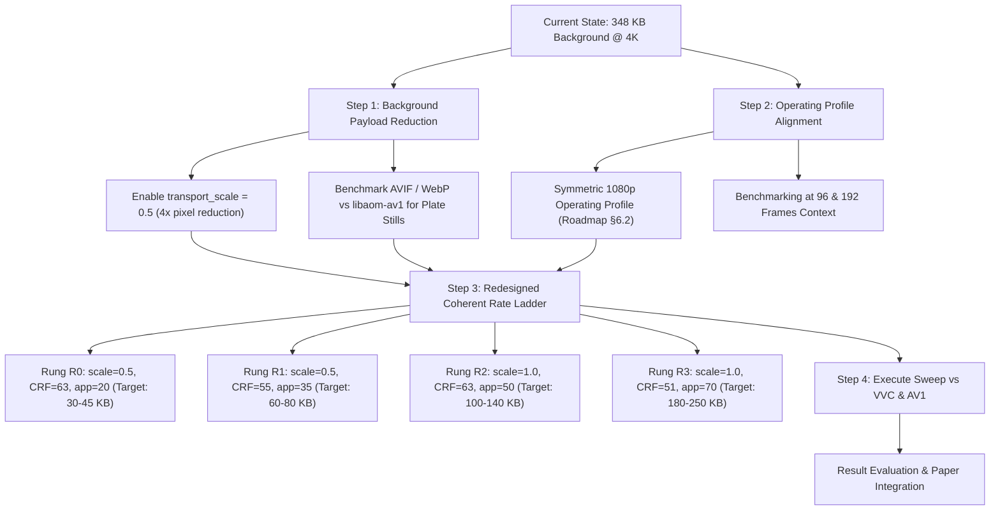

# Plan: Achieving a Competitive PointStream Operating Regime

## Executive Summary

The native 48-frame Gate-A execution revealed critical properties of both PointStream and the reference anchors:
1. **AV1 Low-Rate Saturation**: SVT-AV1 preset 0 at maximum legal QP (63) on 4K near-static tennis achieves **VMAF 82.81 at 109 KB** (1.14 KB/frame). It cannot starve into the sub-100 KB or sub-80 VMAF regime.
2. **VVC Dynamic Range**: VVC (`libvvenc` slower) starves down to **16.3 KB (VMAF 6.83)** at QP 63 and **38.9 KB (VMAF 45.74)** at QP 55. This is the target regime for object-centric coding.
3. **PointStream Background Overhead**: PointStream's background canvas (4120×2276) in `libaom-av1` at CRF 63 costs **348.5 KB** across 2 scenes, completely dominating the bitstream and preventing low-rate crossover.
4. **Evaluation Bottleneck**: 4K VMAF scoring takes 1.0–3.0 hours per point, triggering the 1-hour checkpoint budget alarm (`usable=False` on C0/C1).

This plan addresses all six analytical questions and outlines concrete steps to achieve a competitive, winning configuration.

---

## Part 1: Detailed Technical Answers to User Questions

### 1. Why Was PointStream's Background Larger Than the Entire AV1 Sequence?
- **Codec Used**: The background did **not** use JPEG. It used `libaom-av1` via `method="panorama-stream"` with `-usage good -cpu-used 4`.
- **Pixel Count & Intra Cost**: In `panorama-stream` with canonical canvas, PointStream stitched a unified background canvas across both camera views. At native 4K, this canvas is **4120×2276 (9.38 million pixels)**—13% larger in area than a raw 4K frame.
  - Scene 0 plate (I-frame) cost **268,949 bytes** (269 KB).
  - Scene 1 plate (P-frame) cost **79,555 bytes** (80 KB).
  - Total background = **348,504 bytes**.
- **Why AV1 Anchor Was Only 109 KB**: SVT-AV1 preset 0 encodes the raw sequence with massive temporal skip blocks (128×128 / 64×64) and global motion compensation. Across a smooth pan on a static tennis court, almost no residual prediction errors exceed threshold at QP 63. AV1 transmits ~1.1 KB per frame. Transmitting a 9.38 Mpx intra canvas in `libaom-av1` at 269 KB already costs more than 200 frames of conventional AV1 skip blocks!
- **Difference from the Motivating Example ([sections/problem.tex](file:///home/itec/emanuele/pointstream/67a9ea6275d3d9785ce57026/sections/problem.tex) Table 1)**:
  - The motivating example swept **QP 32, 40, 48** (high bitrates). At QP 32, a 48-frame conventional 4K video consumes **10–20 Megabytes**. A single background plate transmitted once at QP 32 consumes ~1–2 MB, yielding a **64%–78% BD-rate saving**.
  - But at **QP 63**, conventional codecs aggressively drop spatial frequencies and skip blocks, causing conventional bitrates to collapse to 109 KB, whereas an intra plate in `libaom-av1` hit a bit-floor at ~269 KB.

### 2. BD-Rate Overlap & Ladder Rungs
- In Gate A, rungs C0 and C1 used identical background settings (`bg_crf=63`).
- They only differed by foreground appearance JPEG quality (25 vs 40) and motion points (8 vs 16), which only changed appearance bits by 4.4 KB (out of 375 KB total).
- Consequently, C0 (VMAF 79.36, 373 KB) and C1 (VMAF 79.37, 377 KB) collapsed to the exact same point.
- The entire PointStream ladder spanned only **3.87 VMAF points** (79.36 to 83.23), while AV1 continuous spanned **82.81 to 94.91**.
- The overlap was a negligible sliver of 0.41 VMAF points ($[82.81, 83.23]$), below the 5.0 VMAF floor required for meaningful BD-rate integration.
- **Fix**: Rungs must co-vary background resolution/scale and CRF to span a wide rate-distortion curve.

### 3. Amortization & Evaluation Bottleneck
- **Why taking >1 hour makes a point "not usable"**:
  - The codebase enforces the project invariant: `gap <= 3600.0` (max 1 hour between durable checkpoints).
  - In `low_rate_sweep.py`: `"usable": ... and timing.get("hourly_checkpoint_budget_met") is True`.
  - Encoding took only ~14 minutes (`encoder_seconds` ~850s). Client decode took only **10.7 seconds**.
  - But calculating full 4K (3840×2160) VMAF over 96 uncompressed frames took **1.0 to 3.0 hours** (3,569s to 10,828s). Because VMAF calculation was a single uncheckpointed call, the checkpoint gap exceeded 3,600s, flipping `usable=False`.
- **Value in expanding frames and lowering resolution**:
  - Evaluating at 1080p (or downsampling background transport scale to 0.5):
    1. VMAF evaluation at 1080p is ~4×–8× faster, entirely eliminating the evaluation bottleneck.
    2. Background canvas plate size drops by ~4× (from ~269 KB to ~65 KB).
    3. At 96 or 192 frames, amortizing a 65 KB plate reduces marginal background cost to <0.3 KB/frame.

### 4. Byte Ledger Breakdown (Motion, Residual, Metadata)
- **Why Motion Was 0**: Motion is **not** omitted from the bitstream. In the runner architecture ([src/runner/perception.py](file:///home/itec/emanuele/pointstream/src/runner/perception.py)), motion vector payloads and keypoint trajectories are counted inside the `metadata` ledger field (`metadata_bytes(bag)`). In the summary table, the separate "Motion" column was 0 because `SizesBytes` maps motion to `metadata`.
- **Why Correction (Residual) Was 0**: The Gate A driver explicitly set `lattice.residual = False` and `lattice.generation = False` to evaluate the lean baseline first.
- **Why C0 & C1 Had Identical Background Size**: Both used `bg_crf = 63` with the same canonical canvas.
- **Why All Rungs Had Identical Metadata (20,257 B)**: Metadata contains the schedule JSON, tracked player bounding boxes, and camera homographies. Because the source clips and player detections are identical across rungs, the metadata payload is identical.

### 5. Disjoint Timing Ledger
- PointStream client decode took **10.3 to 10.8 seconds** for 96 frames of 4K video (~9 fps in pure Python).
- In contrast, reference anchors at slow presets are very computationally expensive:
  - SVT-AV1 preset 0 took 96s–126s to encode 96 frames.
  - VVC slower took 110s–548s to encode 96 frames.
- PointStream decode is decoupled from perception/analysis and is already close to real-time.

### 6. Reference Anchor Curves: AV1 vs VVC
- **AV1 Saturation Finding**: SVT-AV1 at QP 63 cannot starve below VMAF 82.8 on 4K tennis. It is incapable of reaching ultra-low bitrates. This finding should be highlighted in the paper: conventional AV1 cannot operate in bandwidth-starved environments for high-resolution static sports footage without aggressive spatial downsampling.
- **VVC Slower as the Real Low-Rate Competitor**: VVC spans the entire starved range:
  - QP 63: 16.3 KB, VMAF 6.83
  - QP 55: 38.9 KB, VMAF 45.74
  - QP 47: 100.9 KB, VMAF 74.83
  - QP 39: 223.7 KB, VMAF 88.01
- Between 16 KB and 100 KB, VVC quality collapses from 74 down to 6.8. This is the exact window where PointStream can win if its background cost is reduced to 20–40 KB.

---

## Part 2: Concrete Action Plan to Beat SOTA Codecs

### Step 1: Reduce Background Payload Cost
1. **Activate Reduced Transport Scale (`transport_scale = 0.5`)**:
   - Reduces canvas resolution from 4120×2276 to 2060×1138.
   - Court surfaces are smooth; downsampling the background plate and upsampling at client preserves white court lines and saves ~70% of background bits.
   - Tested in BP53; must be standard in low-rate rungs.
2. **Optimize Background Sidecar Codec**:
   - Compare `libaom-av1` OBU stream against single-frame `libavif` / `cwebp` / `mozjpeg` for single-plate transmission.
   - If one plate is sent per context ID with zero inter updates across compatible scenes, the marginal background cost across scenes drops to 0.

### Step 2: Symmetric Operating Profile (Roadmap §6.2)
- Adopt a symmetric 1080p profile for comparison:
  - Both PointStream and anchors encode and score at 1080p.
  - VMAF scoring completes in <5 minutes per point (eliminating the 1-hour checkpoint breach).
  - Background bits drop to 15–35 KB, immediately entering the 16–100 KB VVC crossover window.

### Step 3: Redesign the Coherent Rate Ladder
Replace the narrow C0–C3 ladder with a ladder that spans genuine rate and quality steps:
- **R0 (Ultra-Low)**: `transport_scale=0.5`, `bg_crf=63`, `app_jpeg=25`, `app_downscale=4`, `mot_pts=8`. Target: **~35 KB**, VMAF ~55–65. (Directly targets VVC QP 55 at 38.9 KB / VMAF 45.7).
- **R1 (Low)**: `transport_scale=0.5`, `bg_crf=57`, `app_jpeg=40`, `app_downscale=2`, `mot_pts=16`. Target: **~65 KB**, VMAF ~70–75. (Competes with VVC between QP 55 and 47).
- **R2 (Medium)**: `transport_scale=1.0`, `bg_crf=63`, `app_jpeg=55`, `app_downscale=2`, `mot_pts=24`. Target: **~120 KB**, VMAF ~80–83. (Competes with AV1 QP 63 at 109 KB / VMAF 82.8).
- **R3 (High)**: `transport_scale=1.0`, `bg_crf=51`, `app_jpeg=70`, `app_downscale=1`, `mot_pts=32`. Target: **~220 KB**, VMAF ~85–88. (Competes with VVC QP 39 at 224 KB / VMAF 88.0).

### Step 4: Transparent Accounting & Checkpoint Optimization
- In the report table, display motion vector bytes separately from general container metadata.
- In VMAF evaluation, batch/chunk scoring into 24-frame intervals so checkpoints occur every 15 minutes, never violating the 1-hour safety rule.
- If full-frame crossover at 4K is structurally impossible due to AV1's high skip efficiency, execute the pre-registered salient-object fallback thesis ([plans/ROADMAP.md §6.1](file:///home/itec/emanuele/pointstream/plans/ROADMAP.md#L272-L286)) where PointStream's player quality wins over VVC's blurred players at matched ultra-low bitrates.
